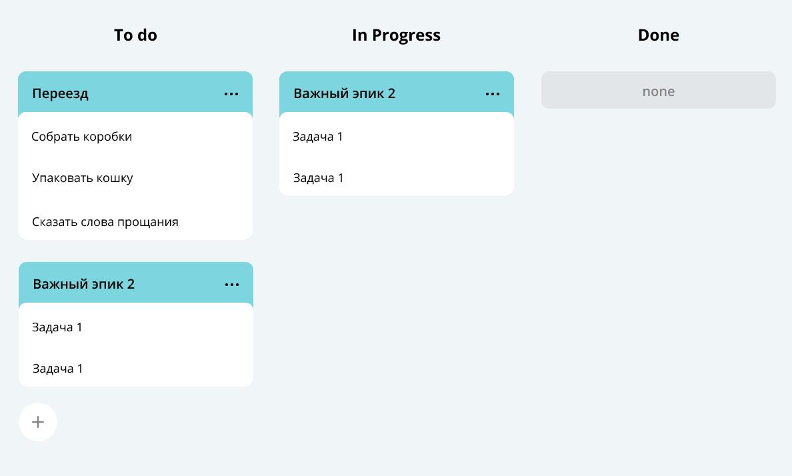

# Учебное приложение "Task Manager"

### Бэкенд трекера задач 

#### Основной функционал:  
создание, обновление, удаление задач или подзадач 
получение списка всех задач или задачи по идентификатору 
вывоз задач в порядке приоритета (по дате начала) 
история просмотра задач 
хранение задач в оперативной памяти, в файле, на сервере 
JUnit 
API, доступ к методам менеджера через HTTP-запросы 

#### Свойства задач 
название 
описание 
уникальный идентификационный номер 
статус, отображающий прогресс: 
     NEW - задача только создана, но к её выполнению ещё не приступили 
     IN_PROGRESS - над задачей ведётся работа 
     DONE - задача выполнена 

#### Типы задач 
Task (обычная задача без подзадач) 
Epic (задача, у которой могут быть подзадачи) 
Subtask (подзадача у Epic) 

#### Условия выполнения задач: 
для каждой подзадачи известно, в рамках какого эпика она выполняется 
каждый эпик знает, какие подзадачи в него входят 
завершение всех подзадач эпика считается завершением эпика 

#### Модель данных:
